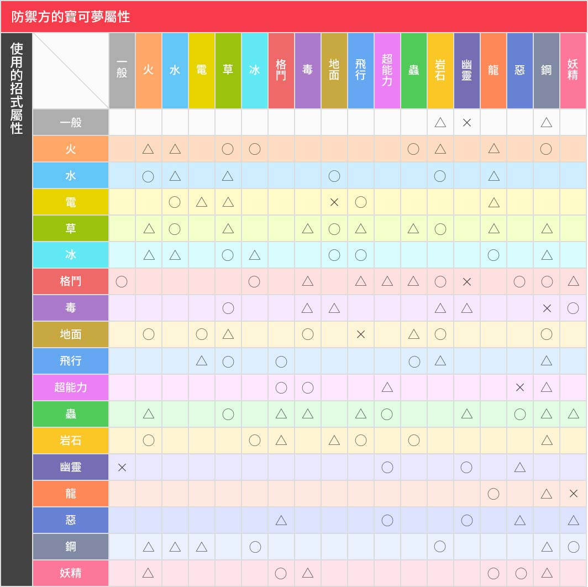

# Pocketmon
1. 每小时一次循环，每八分钟一代，一共七代，最后四分钟会出所有。（有时候会有误差，大概一分钟左右）
   - 第一代 001-151
   - 第二代 152-251
   - 第三代 252-386
   - 第四代 387-493
   - 第五代 494-649
   - 第六代 650-721
   - 第七代 722-809
2. Pokemon的cp初始值和growthRate成正相关
3. 捕获Pokemon以后，每次升级的cp数值的增长量是固定的 $增长值=cp/level$,所以是可以算出100级的cp值 $100级cp值=(cp/level)*100$
4. 1级到100级需要expBerry大概为10890
5. Evolutions
   - 不同的Pokemon进化的次数是不同的。
   - 从最初级到中级进化率大概在1.32-1.34
   - 中级到高级的进化率大概在1.40-1.42
   - 高级到终极的进化率大概在 1.38
   - 进化率和growthRata 目前还没发现有什么关系。
6. 先进化，后升级或者先升级，后进化的结果是一样的。
7.  属性克制表

    - ◯＝效果很好!
    - △＝效果不佳
    - ×＝無效果
    - 無標誌＝效果一般
  - 在Arena中，碰到克制己方pokemon的，可以点击刷新，重新匹配。